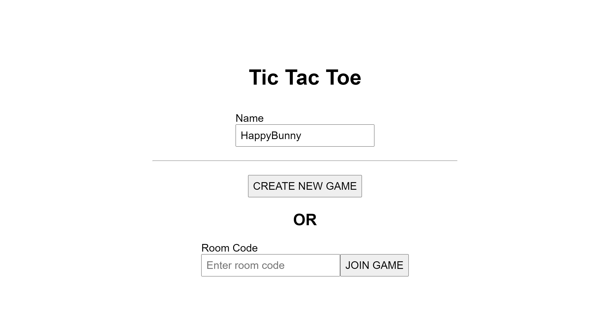
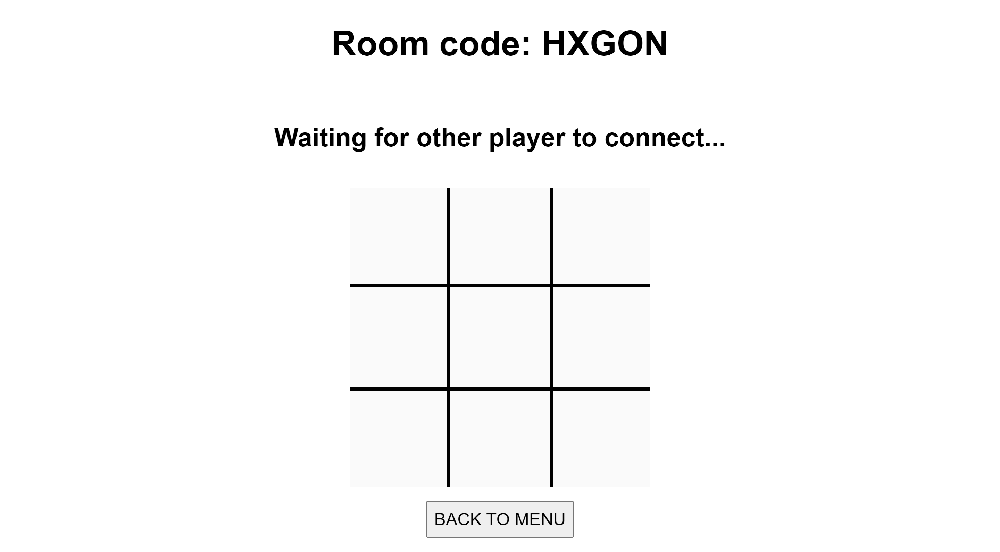
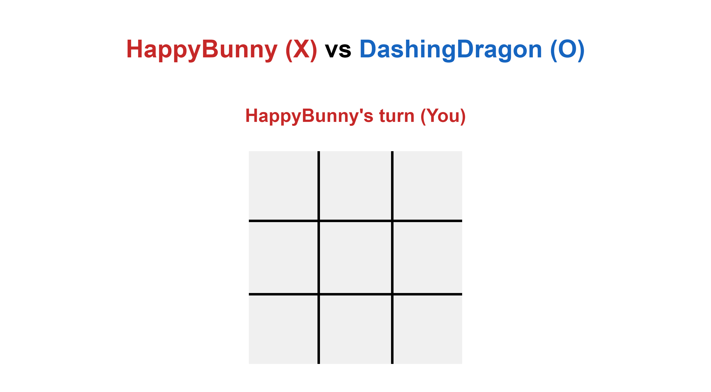
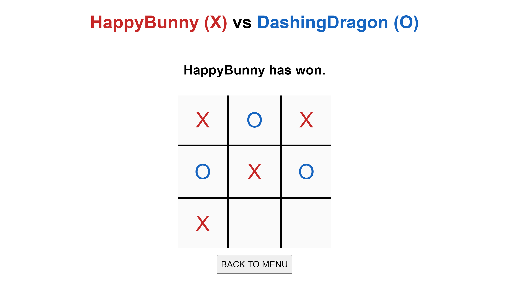

# Tic Tac Toe App for GovTech Assessment

## Overview

This is a web application built using React and NodeJS to allow multiple clients to play Tic-Tac-Toe using the concept
of game sessions (Described as 'rooms' in the app).
The UI design is catered specifically for visually-impaired users and to facilitate the usage of screen readers.

## Quick Start (Running Production)

First, clone this repository locally, and navigate to the folder on your command line.

This repository has been set to the production environment by default. To run the application, first we need to enter into the server folder:

```
$ cd server
```

If this is your **first time** running the application, we need to install the relevant node modules:

```
$ npm install
```

Now we just have to run the server:

```
$ npm start
```

**Leave the command line active**. Now you should be able to access the app at `http://localhost:5000/`

## Running Development

If you wish to run development, some extra steps have to be taken.and Infrastructure Decisions

### Summary

The front-end interface design was designed purposely to help users with poor vision. Design decisions in

First, we need to re-configure the `.env` file on the server side. Edit the `server/.env` file on the server side to the following:

```
PORT = 5000
NODE_ENV = "development"
```

Next, we need to run both the server and client. Starting from the root directory of your local folder containing this repository:

```
$ cd server // navigate into the server folder
$ npm install // run this only if it's your FIRST TIME running the application
$ npm start
```

**Leave the command line active**.

On a **separate** command line, navigate to the repository folder again. Now, we need run the client:

```
$ cd client // navigate into the client folder
$ npm install // run this only if it's your FIRST TIME running the application
$ npm start
```

**Leave the command line active**.

Now you should be able to access the app at `http://localhost:3000/`

## Playing a Game

This app uses the idea of "rooms" to facilitate game sessions.
When you first load up the app, you should be greeted with this screen:

Here, a randomly generated name has been given to you, and you are free to change it to whatever you like.

To create a game, click the "CREATE NEW GAME" button. It should bring you to this page:

Here, you are greeted with a blank Tic-Tac-Toe grid, as well as a randomly generated **room code**.

On a **separate browser window**, load up the app again. (`http://localhost:5000/` if you're on production, `http://localhost:3000/` if you're on development). Copy and paste the earlier room code into the "Room code" text field and click the "JOIN GAME" button.

If done successfully, both players should see a room similar to this (the name's will likely be different):

At this point, a normal game of Tic-Tac-Toe can be played between the 2 players.
Once the game ends, (either by drawing or by a player winning), a screen similar to this should be shown:

At this point, both players can click the "BACK TO MENU" button to leave the room, and start a new game again.

## UI Design Decisions

The front-end interface design was designed purposely to help users with poor vision.
Here are some design decisions that were made for this purpose:

- Large fonts were used throughout the app (Standard font size was `1.25rem`)
- Crosses and circles for the Tic-Tac-Toe game, as well as the players' names, were color-coded for better recognisability
- Standard HTML landmarks were used throughout the app (eg. Usage of `<section>` and header `<h1>,<h2>...` tags) in order to facilitate screen readers
- Full capital letters used for buttons to aid readability

## Backend Architecture Design

This application primarily uses **web sockets** to facilitate each game session.
The server receives 5 events from the client:

- `connect`: When a client connects to the socket
- `joinRoom`: When a client joins a room. Receives the following:
  - `roomId (string)`: The room ID the player wants to join
- `makeMove`: When a client sends a move. Receives the following:
  - `row (int)`: The row of the player's move. 0-indexed.
  - `col (int)`: The column of the player's move. 0-indexed.
- `exitRoom`: When a client exits the room
- `disconnect`: When a client disconnects from the socket

The server also emits 5 events:

- `startGame`: Signals to clients in the room that the game as started. Sends the following:
  - `initTurn (int)`: the starting turn of the game. Either 0 or 1.
  - `playerNames (string[])`: an array containing the player names.
  - `turnToMove (int)`: the turn the client should move on. Either 0 or 1.
- `updateGame`: Sends the updated game state to the clients in the room. Sends the following:
  - `gameState (string[])`: a 3 x 3 string array representing the current game state
  - `turn (int)`: the current turn of the game. Either 0 or 1.
- `alertGame`: Sends an alert message when one of the clients has exited the room (via `exitRoom`). Sends the following:
  - `alert (string | null)`: a string if there is an alert message to be sent, otherwise `null` to indicate that the alert should be cleared
- `endGame`: Signals to the clients that the game has ended, with relevant information. Sends the following:
  - `reason (string)`: the reason why the has ended (Either by the game ending naturally or a player disconnecting)

In additional to websockets, the server also has one `GET` route:

- `[GET] /server/createRoom`: creates a new room for a client. Returns the following:
  - `roomId (string)`: The room ID of the newly created room

2 main entities are being managed throughout the backend: `Player` and `Room`. `Player` essentially represents the connected users, while `Room` represent the game sessions.
They are simply managed using Javascript Maps, as opposed to a DBMS. The primary reason for this is that the lifecycle of each entity is extremely short:

- Each `Player` is only alive for as long as the user is connected to the socket
- Each `Room` is only alive for as long as the game session is on-going. (The moment a game ends, the `Room` is destroyed)

**Relationship**: Each `Player` must be in 0 or 1 rooms, and each `Room` must have 0, 1, 2 players.
